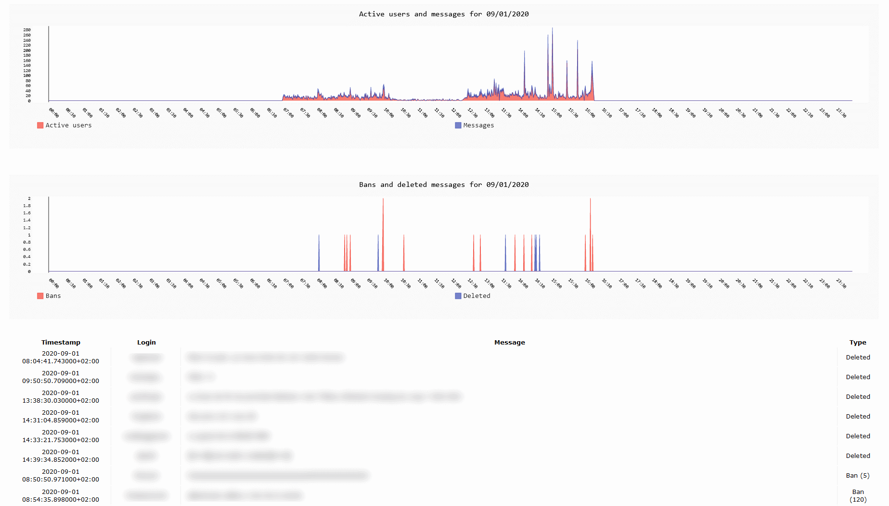

# twitch-stats

 

TwitchStats is a Twitch chat that logs activity like the number of active users and messages every
minute and also the banned users and deleted messages.

TwitchStatsGraph will create a web page with a beautiful pygal graph and a table with deleted messages.

Check the example below.

#### Requirements

- [pygal](https://github.com/streamlink/streamlink)
- [pymongo](https://ffmpeg.org/download.html)
- [pytz](https://ffmpeg.org/download.html)  

#### TwitchStats Usage

- Rename <i>config.example</i> to <i>config</i>
- Update <i>config</i> with your login/oauth token.
- Add the channel you want to log
- Run TwitchStats.py :smile:
    
        [ec2-user@ip twitch-stats]$ python3 main.py
        Starting main.py at Tue Sep  1 13:59:13 2020 (Linux x86_64 4.14.186-146.268.amzn2.x86_64)
        
        [+] creating TwitchStats bot
        [+] adding channel: mychannel
        [+] [mychannel] connecting to Twitch
        [+] [mychannel] starting logging
        [-] [mychannel] poll data: 36 users, 46 messages, 0 bans, 0 deleted
        [-] [mychannel] poll data: 47 users, 59 messages, 0 bans, 0 deleted
        [-] [mychannel] poll data: 21 users, 25 messages, 1 bans, 0 deleted
        [-] [mychannel] poll data: 25 users, 25 messages, 0 bans, 0 deleted
        [-] [mychannel] poll data: 25 users, 27 messages, 0 bans, 0 deleted
        
        
#### TwitchStatsGraph Usage    

- Run TwitchStatsGraph.py :smile:
- I used to run it with watch -n 300 to have the web page updated automatically

        Every 300.0s: python3 TwitchStatsGraph.py                                                           Tue Sep  1 14:17:11 2020
        
        Starting TwitchStatsGraph.py at Tue Sep  1 14:17:11 2020 (Linux x86_64 4.14.186-146.268.amzn2.x86_64)
        
        [+] [mychannel] generate graph 2020-09-01 00:00:00+02:00 -> 2020-09-02 00:00:00+02:00
        [+] [mychannel] messages: 533
        [+] [mychannel] bans    : 16
        [+] [mychannel] deleted : 6

#### Example of web page

